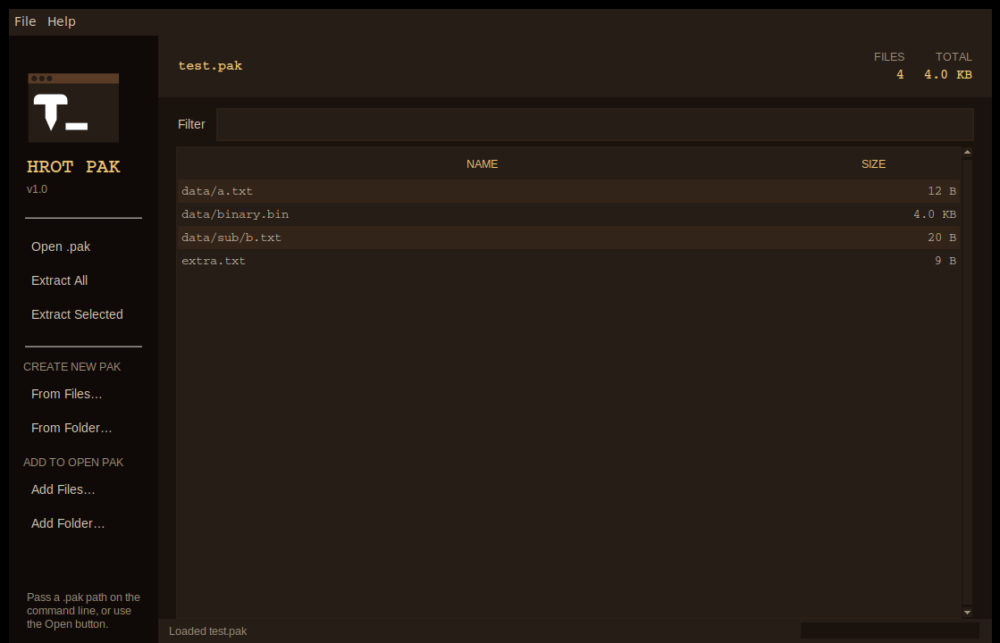

# HROT-GUI-Tools

Open, extract, and build `.pak` archives for [HROT](https://store.steampowered.com/app/824600/HROT/) — the retro-FPS by Spytihněv.



## Get started

You need Python 3.7 or newer. It's already installed on most Linux and macOS systems; on Windows, grab it from [python.org](https://www.python.org/downloads/) and tick *"Add Python to PATH"* during install.

On Debian or Ubuntu Linux you also need Tk:

```sh
sudo apt install python3-tk
```

Then download this folder and double-click `main.py`, or from a terminal:

```sh
python3 main.py
```

That's it — no install step, no virtual environment.

## Looking inside a pak

Click **Open .pak** and pick the file. (`PAK0.PAK` is in your HROT install folder, alongside `hrot.exe`.) The file table fills with everything inside the archive — paths on the left, sizes on the right.

A few things you can do from there:

- **Sort** by clicking the column headers.
- **Filter** by typing in the box above the table. The list narrows as you type.
- **Multi-select** with `Ctrl`/`Shift`-click for the next step.

## Getting files out

**Extract All** copies every file in the archive to a folder you choose. To avoid scattering hundreds of files around, the tool always creates a subfolder named after the archive: extract `PAK0.PAK` to `~/Downloads` and you'll get `~/Downloads/PAK0/` with everything tucked inside.

If you re-extract the same archive later, the new copy goes into `PAK0 (2)/`, then `PAK0 (3)/`, and so on — same convention browsers use for duplicate downloads.

**Extract Selected** does the same thing but only for the rows you've highlighted. Handy if you just want the textures, or one specific sound. **Double-clicking a row** also extracts that single file.

For very large archives, watch the progress bar at the bottom — you can keep using the rest of the window while it works.

## Building a new pak

Four buttons under **CREATE NEW PAK** and **ADD TO OPEN PAK** cover the four cases:

| Button | What it does |
|---|---|
| **From Files…** | Build a new pak from individual files you pick. |
| **From Folder…** | Build a new pak from every file in a folder, recursively. |
| **Add Files…** | Append individual files to the pak you have open. |
| **Add Folder…** | Append every file in a folder to the pak you have open. |

Each button asks two questions in order: *what's going in*, then *where to save it* (for the Create buttons). When you pick a folder named `mymod`, the save dialog opens with `mymod.pak` already in the filename field — just press Enter.

Before any pack runs, a confirmation modal shows what's about to happen:

```
Create mymod.pak with 47 files (12.3 MB)?

  • mymod/textures/wall1.tga
  • mymod/textures/wall2.tga
  • mymod/sounds/footstep.ogg
  • mymod/models/player.mdl
  • … and 43 more
```

That's your last chance to spot a wrong selection before committing. Cancel here and nothing is written.

## Tips and gotchas

**Adding files to an existing pak.** "Add Files…" appends to the open archive. If a file you're adding has the same internal path as one already in the pak, the new copy replaces the old one — the previous version is dropped from the directory. Same as how a zip update works.

**Filename length limit.** HROT's pak format stores filenames in a 119-character field. If you pick a folder containing files with very long internal paths (rare, but possible with deeply-nested folders like `~/.cache/`), those specific files are skipped from the pack and listed in the confirmation dialog. The rest of your pak still builds normally.

**The save path is checked, not just accepted.** Type `mymod` with no extension and the tool adds `.pak`. Type `mymod.zip` and it asks if you meant `.pak`. Pick a path you can't write to and you get a clear error before anything starts. Try to overwrite an existing file and you get an explicit "Replace it?" prompt.

**If something goes wrong mid-pack** — the process crashed, your laptop died, the disk filled up — your original archive is untouched. New paks are written to a temporary file first and only renamed into place once the whole thing is built successfully. There's no half-finished state.

**Linux file dialogs.** On KDE-based distros (CachyOS, Fedora KDE, Kubuntu, etc.) the tool uses `kdialog` for native file pickers; on GNOME it uses `zenity`. If your dialogs misbehave, install one:

```sh
sudo pacman -S kdialog        # Arch / CachyOS
sudo apt install kdialog      # Debian / Ubuntu
sudo apt install zenity       # GNOME systems
```

**Pre-load a pak from the terminal:**

```sh
python3 main.py /path/to/PAK0.PAK
```

## Command-line tools

If you'd rather work from a terminal, two small scripts handle the same jobs:

```sh
python3 unpak.py PAK0.PAK -l                  # list contents
python3 unpak.py PAK0.PAK -d ./out            # extract everything to ./out

python3 pak.py mymod.pak file1.png file2.png  # add files
find ./mod -type f | python3 pak.py mymod.pak # …or pipe a file list in
```

These are kept compatible with [joshuaskelly's original CLI](https://github.com/joshuaskelly/hrot-cli-tools) — same flags, same behaviour. Run any of them with `--help` to see all options.

## What's in the folder

Four Python files. They all need to live together in one folder.

| File | Purpose |
|---|---|
| `main.py` | The GUI — run this one. |
| `pak.py` | Command-line: build a pak. |
| `unpak.py` | Command-line: read a pak. |
| `format.py` | Shared pak reader/writer. The other three import it. |

No third-party dependencies, no `pip install`, no setup script.

## Credits

The command-line side (`pak.py`, `unpak.py`) keeps the interface from [joshuaskelly/hrot-cli-tools](https://github.com/joshuaskelly/hrot-cli-tools) — same flags, same behaviour, same help text. If you only want the original CLI without any of the GUI work, install his package directly with `pip install hrot-cli-tools`.

This project rewrites the underlying format library from scratch (no `vgio` dependency, paks remain byte-compatible in both directions) and adds the graphical interface, the workflow improvements above, and a few small CLI fixes.

## File format

For the curious. HROT paks are the classic Quake `.pak` layout with the magic bytes changed and the filename field widened.

```
Header (12 bytes)
    char    magic[4]            // "HROT"
    int32   directory_offset    // little-endian
    int32   directory_size      // little-endian

File data
    Raw bytes for each file, packed back-to-back.

Directory (128 bytes per entry)
    char    filename[120]       // null-padded ASCII, '/' separator
    int32   file_offset
    int32   file_size
```

## License

MIT, matching joshuaskelly/hrot-cli-tools.
